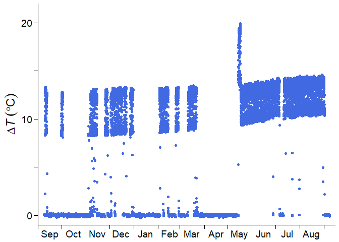
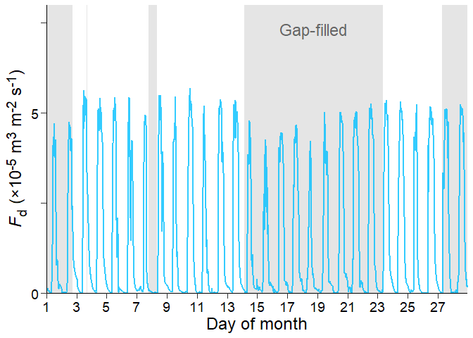

<!-- README.md is generated from README.Rmd. Please edit that file -->

# fluxfixer 

<!-- badges: start -->

[](https://CRAN.R-project.org/package=fluxfixer)
[](https://github.com/yhata86/fluxfixer/actions/workflows/R-CMD-check.yaml)
[](https://app.codecov.io/gh/yhata86/fluxfixer)
<!-- badges: end -->

## Overview

The goal of fluxfixer is to automatically post-process sap flow data
measured by the thermal dissipation method.

Notably, this package can detect outliers and fill data gaps using a
machine learning method that takes environmental variables as input.
These quality control protocols can also be applied to other types of
raw time series with many artifacts.

fluxfixer provides various functions that can detect aberrant structural
changes in time series dynamics, correct such time series, and calculate
sap flux density with different methods for deriving zero-flow
conditions.

Basically, you can conduct the whole process by executing only one
function, `run_fluxfixer()`. Optionally, you can apply each process
step-by-step using the functions such as:

- `check_absolute_limits()` eliminates physically unreasonable values.
- `modify_short_drift()` corrects short-term signal drifts.
- `filter_highfreq_noise()` filters high-frequency noise from the time
  series.
- `remove_zscore_outlier()` detects and removes outliers by Z-score
  transformation.
- `remove_rf_outlier()` detects and removes outliers by a random forest
  model.
- `fill_gaps()` imputes all missing values in the time series by a
  random forest model.
- `retrieve_ts()` converts a standardized Z-score time series into a
  time series in its original units while conducting detrending and
  signal damping correction.

For sap flow data processing:

- `calc_dtmax()` estimates the reference values of observed temperature
  difference between probes under zero-flow conditions (dTmax) with
  multiple methods.
- `calc_fd()` calculates sap flux density, considering the heartwood
  correction.

You can learn more about how to use them in
`browseVignettes("fluxfixer")`.

## Installation

You can install the latest version of fluxfixer from
[CRAN](https://cran.r-project.org/) with:

``` r
install.packages("fluxfixer")
```

Or, you can install the development version from
[GitHub](https://github.com/) with:

``` r
# install.packages("remotes")
remotes::install_github("yhata86/fluxfixer")
```

## Example

Assume that you have conducted a sap flow measurement in Malaysia from
Sep. 2012 to Aug. 2013, and obtained a half-hourly time series below:



where $\Delta T$ is the temperature difference between sap flow probes,
which will be used in calculating the sap flux density ($F_\mathrm{d}$).

You may feel upset since the time series has:

- many values near zero due to power supply shortages
- short-term drift in May, just after sensor replacement
- long-term trend of the daily maximum value because of sensor
  degradation

Do not worry. fluxfixer can rescue this time series and output a
continuous, stationary time series.

To begin with, you prepare a dataset containing raw $\Delta T$ and other
environmental variables, and specify the timestamps of the events.

``` r
## Load sample data
data("dt_noisy")

## Specify the period of the short-term drift
time_drft_head <- as.POSIXct("2013/05/14 13:30", tz = "Etc/GMT-8")
time_drft_tail <- as.POSIXct("2013/05/17 15:00", tz = "Etc/GMT-8")

## Specify the sensor replacement timing
time_prd_tail <- as.POSIXct("2013/05/14 13:00", tz = "Etc/GMT-8")
```

Then, the only thing you need is to execute `run_fluxfixer()` as:

``` r
## Run all processes automatically
result <-
  run_fluxfixer(df = dt_noisy,
                colname_time = "time",
                colname_target = "dt",
                vctr_time_drft_head = time_drft_head,
                vctr_time_drft_tail = time_drft_tail,
                vctr_time_prd_tail = time_prd_tail,
                detrend = TRUE)
```

You can derive a data frame containing the post-processed time series
below.


The output data frame also contains $F_\mathrm{d}$ time series, which
you ultimately want. Here is an example of the post-processed
half-hourly $F_\mathrm{d}$ time series in Feb. 2013.



The shaded area represents the gap-filled period by the random forest
model. You can see that the imputed time series reproduced the diurnal
cycle of the non-imputed time series successfully.

## License

This package is open-source and released under the MIT License. See the
LICENSE file for more details.
