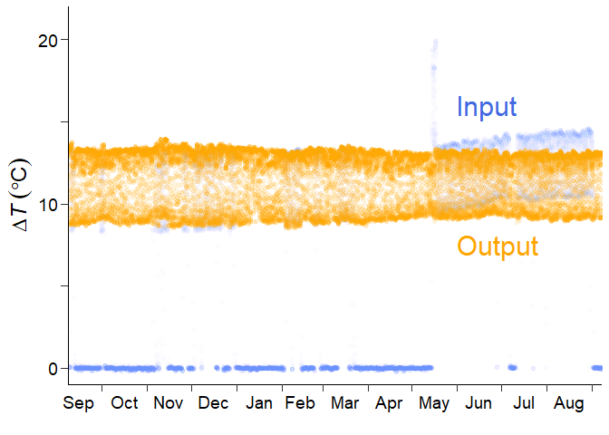

```{r, include = FALSE}
knitr::opts_chunk$set(
  collapse = TRUE,
  comment = "#>"
)
```

# Introduction

fluxfixer provides a sophisticated protocol for post-processing raw time series, which can be applied not only to thermal dissipation sap flow data but also to other noisy time series, using classic statistical and machine-learning methods.

This vignette demonstrates how to use the main functions by showing the actual post-processing of sap flow data observed in Malaysia.

# Installation

You can install the latest version of fluxfixer from [CRAN](https://cran.r-project.org/) with:

```{r cran, eval = FALSE}
install.packages("fluxfixer")
```

Or, you can install the development version from [GitHub](https://github.com/) with:

```{r github, eval = FALSE}
# install.packages("remotes")
remotes::install_github("yhata86/fluxfixer")
```

Then, load and attach the package.

```{r setup, message = FALSE, warning = FALSE}
library(fluxfixer)
```

# Workflow

Now you can use various functions in the package.
Please check the demonstration below, consisting of three sections.

The first section shows how to prepare input data suitable for the whole post-processing protocol.
You can learn which variables are needed for the processes you want to conduct.

The second section explains the way to apply all the processes to the input data automatically.
You will understand which arguments should be set correctly based on the input data and required processes.

The third section demonstrates how you apply each process step-by-step to the input data.
This will be helpful if you are not satisfied with the automatic process result and modify the details of each process.

## Data preparation

To begin with, you need to prepare an input data frame.
This preparation depends on which type of time series you want to post-process.

### For thermal dissipation sap flow time series

The variables listed in the table below are mandatory for each method to determine zero-flow conditions (SP: Successive predawn method; PD: Daily predawn method; MW: Moving window method; DR: Double regression method; ED: Environmental dependent method).

| Variable                              | Type                 | SP      | PD      | MW      | DR          | ED      |
|:--------------------------------------|:---------------------|:-------:|:-------:|:-------:| :-------:|:-------:|
| Timestamp                             | POSIX.ct or POSIX.lt | &check; | &check; | &check; | &check;  | &check; |
| $\Delta T~(^\circ \mathrm{C})$        | Numeric              | &check; | &check; | &check; | &check;  | &check; |
| Global solar radiation (W m^-2^)      | Numeric              |         | &check; | &check; | &check;  | &check; |
| Air temperature $(^\circ \mathrm{C})$ | Numeric              |         |         |         |              | &check; |
| Vapor pressure deficit (hPa)          | Numeric              |         |         |         |              | &check; |

$\Delta T$ is the temperature difference between sap flow probes.
You can select the multiple methods at once during the automatic processing.

Here are the more details of each variable column.

* Timestamp: A timestamp of class POSIXct or POSIXt, indicating the timings of the end of each measurement in local time.
Any interval (typically 15 to 60 min) is allowed, but the timestamps must be equally spaced and arranged chronologically.

* $\Delta T$: A numeric value of the temperature difference between sap flow probes.
The units should be in $^\circ \mathrm{C}$.
It is acceptable to include missing values, but the label representing the missing value must be unique such as `-9999`.

* Global solar radiation: A numeric value indicating incident short-wave radiation.
The units should be in W m^-2^.
If you choose the PD, MW, DR, or ED methods, the time series must be included and gap-filled previously.
These methods use it only to define daytime, so you can use PPFD (photosynthetic photon flux density) or another variable with a strong correlation with global solar radiation.
In such cases, you must modify the threshold value for daytime definition specified by the argument `thres_radi` in `run_fluxfixer()` or `calc_dtmax()`.
In case you have no radiative time series, this package offers the `calc_sw_in_toa()` function that estimates the global solar radiation at the top of the atmosphere at a specific location.
You can add this time series to your input data frame and determine the zero-flow conditions.
See more details in `?calc_sw_in_toa()`.

* Air temperature: A numeric value and its units should be in$^\circ \mathrm{C}$.
If you select the ED method, this time series must be included and gap-filled previously.

* Vapor pressure deficit (VPD): A numeric value representing the difference between saturated water vapor pressure and the actual partial water vapor pressure in the atmosphere.
The units should be in hPa.
If you select the ED method, this time series must be included and gap-filled previously.
And even if you do not select the ED method, the VPD is recommended to be included in the input data frame to construct a more powerful random forest model for outlier detection and gap-filling processes, as the VPD typically controls the opening of plant stomata.
In this case, you do not have to fill gaps in the time series previously.

* Other variables: Even when you select only the SP method, you need to add as many drivers that influence sap flow dynamics as possible in the input data frame to construct a more powerful random forest model for outlier detection and gap-filling processes.
For example, if you want to post-process sap flow data observed in a deciduous forest, you are recommended to include a time series representing forest leaf amount, such as LAI (leaf area index).

You can also include columns that are unrelated to the post-processing, but be sure to indicate which variables are to be used in the random forest construction when you execute `run_fluxfixer()` by specifying `vctr_colname_feature`.

### For time series unrelated to thermal dissipation sap flow

In this case, the input data frame is required to have the columns below.

* Timestamp: A timestamp of class POSIXct or POSIXt, indicating the timings of the end of each measurement in local time.
Any interval is allowed, but the timestamps must be equally spaced and arranged chronologically.

* Target variable: A numeric value of the variable you want to post-process.
It is acceptable to include missing values, but the label representing the missing value must be unique such as `-9999`.

* Other variables: You need to add as many drivers that influence targeted variable dynamics as possible in the input data frame to construct a more powerful random forest model for outlier detection and gap-filling processes.

You can also include columns that are unrelated to the post-processing, but be sure to indicate which variables are to be used in the random forest construction when you execute `run_fluxfixer()` by specifying `vctr_colname_feature`.

## Automatic execution of all processes

This section shows how to use the function `run_fluxfixer()` by post-processing half-hourly $\Delta T$ time series observed in Malaysia from Sep. 2012 to Aug. 2013.

Even in the case you want to execute `run_fluxfixer()` for non-sap-flow time series, the process is similar.
But you need to set an argument, `skip_sapflow_calc`, to `TRUE` (default is `FALSE`), and the function skips the processes specific to the sap flow data, such as the zero-flow conditions estimation and sap flux density calculation.

Let's start by loading the sample data frame.

```{r vign_raw}
## Load sample data
data("dt_noisy")
```

This data frame contains the columns below.

* `time`: Timestamp of the measurement end timing in local time
* `dt`: $\Delta T$ time series ($^\circ \mathrm{C}$)
* `p`: Precipitation (mm)
* `sw_in`: Global solar radiation (W m^-2^)
* `ta`: Air temperature ($^\circ \mathrm{C}$)
* `vpd`: Vapor pressure deficit (hPa)
* `ws`: Horizontal wind speed (m s^-1^)
* `swc`: Soil water content (m^3 m^-3^)}

You can check the details of the data frame in `?data("dt_noisy")` if necessary.
The target column is `dt`, so check this time series visually first.


Or, you can check the time series in a specific period by the code below.

```{r vign_checkraw, eval = FALSE}
## Just for the visualization
# install.packages("ggplot2)
library(ggplot2)

## Set the period you want to check
time_head <- as.POSIXct("2012/09/01 00:30", tz = "Etc/GMT-8")
time_tail <- as.POSIXct("2013/09/01 00:00", tz = "Etc/GMT-8")

dt_noisy %>% 
  dplyr::mutate(dplyr::across(tidyselect::where(is.numeric),
                              ~dplyr::na_if(., -9999))) %>% 
  ggplot2::ggplot()+
  scale_x_datetime(limits = c(time_head, time_tail))+
  geom_point(aes(time, dt), col = "royalblue")
```

From this visualization, you would come up with some ideas for post-processing.

* There is a short-term signal drift in May 2013.
The short-term drift correction is needed.

* There is no high-frequency noise contamination throughout the measurement period.
The high-frequency noise filtering is not required.

* Long-term gradual signal trend exists.
Detrending is needed for preventing the underestimation of sap flux density.

* Signal damping, which means the gradual decrease in signal standard deviation, did not occur.
The signal damping correction is not required.

* The sap flow sensor was replaced in May 2013, according to the information from a data provider.
The measurement sub-period should be set.

Now, you are able to set appropriate arguments in `run_fluxfixer()` and execute it.

```{r vign_auto, eval = FALSE}
## Specify the period of the short-term drift
time_drft_head <- as.POSIXct("2013/05/14 13:30", tz = "Etc/GMT-8")
time_drft_tail <- as.POSIXct("2013/05/17 15:00", tz = "Etc/GMT-8")

## Specify the sensor replacement timing
time_prd_tail <- as.POSIXct("2013/05/14 13:00", tz = "Etc/GMT-8")

## Run all processes automatically
result <-
  run_fluxfixer(df = dt_noisy,
                colname_time = "time",
                colname_target = "dt",
                vctr_time_drft_head = time_drft_head,
                vctr_time_drft_tail = time_drft_tail,
                vctr_time_prd_tail = time_prd_tail,
                detrend = TRUE)
```

Note that, in the default arguments, this function does not conduct the short-term drift correction, noise filtering, detrending, or signal damping correction.
Also, only the SP method is applied by default to estimate zero-flow conditions.

The `result` data frame contains columns below.

* `time`: The same timestamp as the input timestamp specified by `colname_time`.

* `raw`: The same input $\Delta T$ time series specified by `colname_target`.

* `processed`: The post-processed $\Delta T$ time series

* `qc`: A quality-control (QC) flag time series indicating the history of modifications to each data point.
    See more details in `?run_fluxfixer`

* `dtmax_sp`: $\Delta T_\mathrm{max}$ (the maximum temperature difference between sap flow probes under zero-flow conditions) time series calculated by the SP method.

* `fd_sp`: $F_\mathrm{d}$ (sap flux density) time series using $\Delta T_\mathrm{max}$ calculated by the SP method.

You can confirm whether this function post-processed the raw time series appropriately by drawing the graph.



The blue and orange points represent the raw and processed $\Delta T$ time series.
The function was able to remove error values and outliers, correct the short-term drift, fill missing values, and do detrending.

You can also check the time series in a specific period by the code below.

```{r vign_checkresult, eval = FALSE}
## Set the period you want to check
time_head <- as.POSIXct("2012/09/01 00:30", tz = "Etc/GMT-8")
time_tail <- as.POSIXct("2013/09/01 00:00", tz = "Etc/GMT-8")

result %>% 
  dplyr::mutate(dplyr::across(tidyselect::where(is.numeric),
                              ~dplyr::na_if(., -9999))) %>% 
  ggplot2::ggplot()+
  scale_x_datetime(limits = c(time_head, time_tail))+
  geom_point(aes(time, raw), col = "royalblue", alpha = 0.01)+
  geom_point(aes(time, processed), col = "orange", alpha = 0.1)
```

If you want to know what happened in the automated process, let's move the following section.
You will be able to learn how the raw data is modified in each process, and use the `run_fluxfixer()` function or other related functions more flexibly by setting various arguments appropriately.

## Step-by-step executions of each process

### Data Input

For those who jumped into this section directly, please load the sample data first.

```{r vign_loadagain}
## Load sample data
data("dt_noisy")
```

Let's explore the functions deeply that comprise the automated function, `run_fluxfixer()`.

### Anomaly correction

To begin with, you remove anomalies and correct the time series.
This process is divided into three procedures: the absolute limit test, the short-term drift correction, and the high-frequency noise removal.

#### Absolute limit test

`check_absolute_limits()` removes out-of-range values by setting lower and upper limits.
By default, this function removes the values less than 3 or more than 50, assuming the input vector is a $\Delta T$ time series.
You can set these threshold values according to the reasonable range of the input time series by specifying `thres_al_min` and `thres_al_max` arguments.

```{r vign_al, eval = FALSE}
## Conduct the absolute limit test
df_all <-
  dt_noisy %>% 
  dplyr::mutate(dt_al = check_absolute_limits(vctr_target = dt))
```

You got the new column, `dt_al`, in the data frame.
This column indicates the $\Delta T$ time series after the out-of-range value removal.

#### Short-term drift correction (optional)

`modify_short_drift()` corrects sudden changes in the average in the time series over a short period (hours to days) specified by `vctr_time_drft_head` and `vctr_time_drft_tail`.
Multiple short-term drifts can be corrected at once using this function.
This procedure uses a reference period, defined as the number of days specified by `n_day_ref` before and after the occurrence of the anomaly.
Then, the anomalous time series is standardized so that the 5th and 95th percentile values of the anomalous and reference (non-anomalous) time series match over this period.
These percentile values are used instead of the maximum and minimum values to ensure robustness against possible outliers in the original or reference time series.

As indicated in the previous section, the input time series has a short-term signal drift in May 2013.
So, you need to conduct this optional process.

```{r vign_sdc, eval = FALSE}
## Specify the period of the short-term drift
time_drft_head <- as.POSIXct("2013/05/14 13:30", tz = "Etc/GMT-8")
time_drft_tail <- as.POSIXct("2013/05/17 15:00", tz = "Etc/GMT-8")

## Conduct the short-term drift correction
df_all <-
  df_all %>% 
  dplyr::mutate(dt_sdc = modify_short_drift(vctr_time = time,
                                            vctr_target = dt_al,
                                            vctr_time_drft_head = time_drft_head,
                                            vctr_time_drft_tail = time_drft_tail))
```

The column `dt_sdc` represents the $\Delta T$ time series after the correction.

#### High-frequency noise removal (optional)

`filter_highfreq_noise()` filters a time series with a specific period by convolving it with a Gaussian window, removing high-frequency noise.
The period to be filtered can be specified by `vctr_time_noise`.
Also, you can modify the shape of the Gaussian window by `wndw_size_noise` and `inv_sigma_noise` arguments.

For the sample data, there is no high-frequency noise contamination.
So, you do not have to conduct this optional process.

### Outlier removal

The next step is to remove outliers in the target time series.
This process consists of two procedures: Z-score outlier removal and random forest outlier removal.

#### Z-score outlier removal

`remove_zscore_outlier()` detects and removes outliers by converting an original time series into a Z-score time series using a moving window.

The Z-score is calculated by subtracting the average from the original value and dividing it by the standard deviation.
The input time series is standardized using a moving window, and the data values are converted to Z-scores.
In this step, the width of the moving window, specified by `wndw_size_z`, is set to 15 days by default, centered on the target time point, and standardization is performed individually for each time point in the time series.
The upper and lower limits of the Z-score, specified by `thres_z` (default: ±5), are set, and data points outside that range are removed as outliers.
After the outliers have been removed, the Z-score is returned to the original value using the original mean and standard deviation time series, and standardization is performed again using a moving window to remove additional outliers.
These procedures are repeated until either no more outliers are removed or the maximum number of iterations, specified by `n_calc_max` (default: 10), is reached.

Users can define sub-periods across the entire time series using `vctr_time_prd_tail`, and the Z-score conversion is performed in each sub-period separately.
This separated conversion is useful when the input time series suddenly changes its nature, such as after a sensor replacement.

For the sample data process, the sensor replacement occurred in May 2013.
So, you are recommended to set the sub-period.

```{r vign_zs, eval = FALSE}
## Specify the sensor replacement timing
time_prd_tail <- as.POSIXct("2013/05/14 13:00", tz = "Etc/GMT-8")

## Conduct the Z-score outlier removal
df_z <-
  remove_zscore_outlier(vctr_time = df_all$time,
                        vctr_target = df_all$dt_sdc,
                        vctr_time_prd_tail = time_prd_tail)

df_all <-
  df_z %>% 
  dplyr::select(z_cleaned, avg_cleaned, sd_cleaned) %>% 
  dplyr::bind_cols(df_all, .)
```

The column `z_cleaned` represents the standardized $\Delta T$ time series after the Z-score outlier removal.

In some cases, for sap flow measurements, the input $\Delta T$ time series may yield a signal that is attenuated for only a short period, for example, when rainfall continues for days, causing the moving window mean (or standard deviation) to increase (or decrease).
In such cases, standardization will cause the Z-score time series immediately before and after the rainfall to be unnaturally distorted, hindering the construction of the random forest model.
If `modify_z` is `TRUE`, after the outlier removal, this function modifies the Z-score time series for periods when the moving window average has an upward peak, and the moving window standard deviation has a downward peak simultaneously.
See more details in `?remove_zscore_outlier`.

#### Random forest outlier removal

`remove_rf_outlier()` detects and removes outliers by a random forest model whose hyperparameters are calibrated using a grid search approach and out-of-bag evaluation.

A random forest model is constructed for the targeted time series to remove outliers.
The time series is assumed to be stationary, so the standardized time series is suitable for this process.
You can input any feature from the input data frame, and out-of-bag evaluation is used to determine the hyperparameters.
This evaluation is applied to a training dataset separated from the entire input data. To reduce the computational cost, the only hyperparameter used by default for grid search is the number of candidate features (`vctr_m_try`).
To reduce the risk of learning noise, the training data sampling ratio, specified by `vctr_subsample_outlier`, is set to 0.1 by default.
After determining the optimal hyperparameters, they are used to construct the optimal random forest model.
Output values are obtained from 500 (default; specified by `n_tree`) trees, and the first quartile (Q~1~), third quartile (Q~3~), and interquartile range (IQR) of the output values at each time point are calculated.
If the targeted value is less than $\mathrm{Q_1 − 1.5IQR}$ or more than $\mathrm{Q_3 + 1.5IQR}$ (default), the data point is identified as an outlier and removed. The coefficient 1.5 can be changed by `coef_iqr`.

The sample data frame contains time series of environmental factors, including precipitation (`p`), global solar radiation (`sw_in`), air temperature (`ta`), vapor pressure deficit (`vpd`), horizontal wind speed (`ws`), and soil water content (`swc`).
Using these drivers, you can construct a more precise random forest model.

Note that if you do not specify the explanatory variable names in `vctr_colname_feature`, all of the columns excluding the column specified in `colname_label` are used for the construction.

```{r vign_rf, eval = FALSE}
## Conduct the random forest outlier removal
df_rf <-
  remove_rf_outlier(df = df_all,
                    colname_label = "z_cleaned",
                    vctr_colname_feature = c("p", "sw_in", "ta", "vpd", "ws", "swc"))

df_all <-
  df_all %>% 
  dplyr::mutate(z_rf = df_rf$stats$cleaned)
```

The column `z_rf` in the `df_all` data frame represents the standardized $\Delta T$ time series after the random forest outlier removal.

If you want to remove more outliers remaining in the output time series by visual inspection, consider using `remove_manually()`.
However, manual outlier removal is not recommended due to its high subjectivity.

Additionally, if you want to conduct signal detrending or damping correction in the following processes, you need to define the reference values of the average and standard deviation.
Using the cleaned time series after the two outlier removal processes, `calc_ref_stats()` determines these reference values by calculating the median of the statistical values for the first several days in each sub-period.
See more details in `?calc_ref_stats`.

For the sample data process, you will apply detrending.
So, you have to calculate the reference statistics now.
Note that this calculation is applied to the target time series in its original units, so you need to convert the cleaned Z-score time series before inputting it to `calc_ref_stats()`.

```{r vign_crs, eval = FALSE}
## Calculate the reference values of average and standard deviation
vctr_stats_ref <-
        data.frame(z_target = df_all$z_rf,
                   avg_target = df_z$avg_cleaned,
                   sd_target = df_z$sd_cleaned) %>%
        dplyr::mutate(target = ifelse(z_target != -9999 &
                                        avg_target != -9999 &
                                        sd_target != -9999,
                                      z_target * sd_target + avg_target,
                                      -9999)) %>%
        dplyr::pull(target) %>%
        calc_ref_stats(vctr_time = df_all$time,
                       vctr_target = .,
                       vctr_time_prd_tail = time_prd_tail)
```

`vctr_stats_ref` has the two components: the first one is the reference average, and the second one is the reference standard deviation.

### Gap-filling

`fill_gaps()` replaces all missing values in a target time series with values estimated by a random forest model.
The hyperparameter calibration process is the same as that of the random forest outlier removal.
After determining the optimal hyperparameters, they are used to construct the optimal random forest model.
Predicted time series are equal to average from 500 (default; specified by `n_tree`) tree outputs at each time point. If the input targeted value is missing, the predicted value is used for the imputation.

```{r vign_gf, eval = FALSE}
## Fill all the missing values by the random forest model
df_gf <-
  fill_gaps(df = df_all,
            colname_label = "z_rf",
            vctr_colname_feature = c("p", "sw_in", "ta", "vpd", "ws", "swc"))

df_all <-
  df_all %>% 
  dplyr::mutate(z_gf = df_gf$stats$gapfilled)
```

The column `z_gf` in the `df_all` data frame represents the gap-filled standardized $\Delta T$ time series.

### Time series retrieval

`retrieve_ts()` converts the standardized Z-score time series into a time series in its original units.
This retrieval is performed by multiplying the Z-score by the standard deviation and adding the average.
If the average and standard deviation time series are the same as those in converting the original time series into the Z-score time series, the original values with the original average and standard deviation are retrieved.
If reference values of the average and/or standard deviation are used, the output time series are detrended and/or applied to signal damping correction.

For the sample data process, detrending is needed.
So, you set `detrend` as `TRUE`, input the reference average calculated by `calc_ref_stats()` into `avg_ref`, and let `correct_damping` remain `FALSE`.

```{r vign_rt, eval = FALSE}
## Retrieve the time series in its original units
df_all <-
  df_all %>%
  dplyr::mutate(dt_processed = retrieve_ts(vctr_target_z = df_all$z_gf,
                                           vctr_target_sd = df_all$sd_cleaned,
                                           detrend = TRUE,
                                           avg_ref = vctr_stats_ref[1]))
```

The column `dt_processed` represents the quality-controlled $\Delta T$ time series, and the same as the output time series by `run_fluxfixer()` in the previous section.
Well done!

In the following parts, you will learn the processes specific to thermal dissipation sap flow data.

### Zero-flow conditions determination

`calc_dtmax()` provides multiple $\Delta T_\mathrm{max}$ time series estimated by different methods below:

* The successive predawn (SP) method defines the $\Delta T_\mathrm{max}$ for a day as the maximum $\Delta T$ within a 24-hour period that begins at 5:00 a.m. (default; just before daybreak in temperate zones and specified by `thres_hour_sp`).
In other words, the day starts at predawn, not midnight, and the maximum value for that period is assumed to be $\Delta T_\mathrm{max}$.
This method has the advantage of being able to calculate $\Delta T_\mathrm{max}$ quickly while minimizing the effect of nocturnal transpiration on $\Delta T_\mathrm{max}$ estimation.

* The daily predawn (PD) method defines the $\Delta T_\mathrm{max}$ for a day as the maximum $\Delta T$ between midnight and the morning (8:00 a.m. in local time, specified by `thres_hour_pd`) when the global solar radiation is below the threshold value, specified by `thres_radi`.
See more details in [Peters et al. (2018)](https://doi.org/10.1111/nph.15241).

* The moving window (MW) method selects the maximum value of $\Delta T_\mathrm{max}$, estimated by the PD method, using a moving window with an eleven-day length (default; specified by `wndw_size_dtmax`).
The selected $\Delta T_\mathrm{max}$ is considered to be the final $\Delta T_\mathrm{max}$.
See more details in [Peters et al. (2018)](https://doi.org/10.1111/nph.15241).

* The double regression (DR) method first calculates the moving window mean value of $\Delta T_\mathrm{max}$, estimated by the PD method, with an eleven-day length (default; specified by `wndw_size_dtmax`).
The $\Delta T_\mathrm{max}$ that is lower than the mean is omitted, and then the moving window mean is recalculated as the final $\Delta T_\mathrm{max}$.
See more details in [Peters et al. (2018)](https://doi.org/10.1111/nph.15241).

* The environmental dependent (ED) method filters the $\Delta T_\mathrm{max}$, estimated by the PD method, using the environmental conditions when plants let their sap flow nearly zero.
A stable $\Delta T$, with a low coefficient of variation, and low air temperature or vapor pressure deficit over a two-hour period, characterizes these zero-flow conditions.
The threshold values can be changed by `thres_cv`, `thres_ta`, and `thres_vpd` arguments.
See more details in [Oishi et al. (2016)](https://doi.org/10.1016/j.softx.2016.07.003) and [Peters et al. (2018)](https://doi.org/10.1111/nph.15241).
After the filtering, the daily $\Delta T_\mathrm{max}$ is interpolated if necessary.

By default, `calc_dtmax()` only outputs $\Delta T_\mathrm{max}$ time series by the SP method.
You can select any combination of the methods by specifying `method`, such as `method = c("sp", "pd")`.
Make sure you indicate the vectors of the meteorological variables required for the selected methods into `vctr_radi`, `vctr_ta`, and `vctr_vpd` arguments.
See the table in the "Data preparation" section to check which variables are needed for each method.

```{r vign_dtmax, eval = FALSE}
## Calculate dTmax by the SP and PD methods
df_dtmax <-
  calc_dtmax(vctr_time = df_all$time,
             vctr_dt = df_all$dt_processed,
             vctr_radi = df_all$sw_in,
             method = c("sp", "pd"))

df_all <-
  df_dtmax %>% 
  dplyr::select(dtmax_sp, dtmax_pd) %>% 
  dplyr::bind_cols(df_all, .)
```

The columns `dtmax_sp` and `dtmax_pd` represent the $\Delta T_\mathrm{max}$ time series calculated by the SP and PD method, respectively.

### Sap flux density calculation

This is the final step. `calc_fd()` calculates $F_\mathrm{d}$ (sap flux density) time series, including heartwood correction.
$F_\mathrm{d}$ is estimated using a power-type function introduced by Granier ([1985](http://doi.org/10.1051/forest:19850204), [1987](http://doi.org/10.1093/treephys/3.4.309)).
First, a dimensionless index K is obtained from $\Delta T$ and $\Delta T_\mathrm{max}$.
Second, K is raised to the power `beta` and then multiplied by `alpha`, obtaining $F_\mathrm{d}$.

If the sapwood width is shorter than the probe insertion length, $\Delta T$ can be overestimated, resulting in an underestimation of $F_\mathrm{d}$.
Therefore, heartwood correction is required to correct $\Delta T$.
Optionally, before calculating $F_\mathrm{d}$, $\Delta T$ can be replaced with the corrected $\Delta T$ by specifying the ratio of the probe length to sapwood width.
This correction assumes that the $\Delta T$ measured by the part of the probe that is inserted into the heartwood is always $\Delta T_\mathrm{max}$.
See more details in [Clearwater et al. (1999)](http://doi.org/10.1093/treephys/19.10.681).

For the sample data process, there is no need to do the heartwood correction.
So, you let `do_heartwood_correction` remain `FALSE`.

```{r vign_fd, eval = FALSE}
## Calculate Fd using the dTmax estimated by the SP and PD methods
df_all <-
  df_all %>% 
  dplyr::mutate(fd_sp = calc_fd(vctr_dt = dt_processed,
                                vctr_dtmax = dtmax_sp),
                fd_pd = calc_fd(vctr_dt = dt_processed,
                                vctr_dtmax = dtmax_pd))
```

The columns `fd_sp` and `fd_pd` represent the calculated $F_\mathrm{d}$ time series using the $\Delta T_\mathrm{max}$ estimated by the SP and PD method, respectively.

Congratulations!
Now you can use these functions and `run_fluxfixer()` more appropriately and flexibly.
I hope the fluxfixer will make your data quality control tasks less painful.

If you have any questions, please check each function's help page first, then feel free to contact me.

